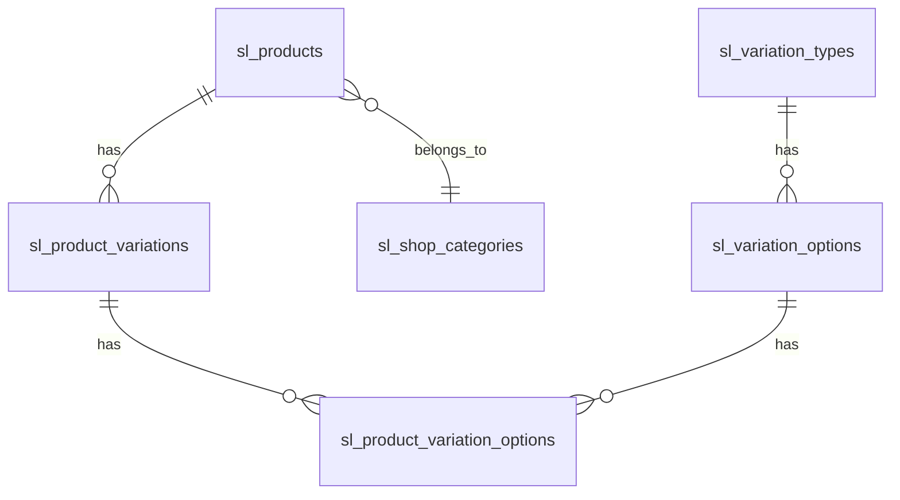

# Product Management System Documentation

## Overview
This document describes the architecture, database schema, API endpoints, and frontend/admin UI for the product management system, including robust support for product variations (types/options), categories, and admin controls.

---

## 1. Database Schema

### **Tables**

#### `sl_products`
- `product_id` (PK)
- `name`
- `description`
- `price_points`
- `category_id` (FK → `sl_shop_categories`)
- `image_url`
- `is_active`
- `created_at`, `updated_at`

#### `sl_shop_categories`
- `category_id` (PK)
- `category_name` (unique)
- `is_active`
- `created_at`, `updated_at`

#### `sl_variation_types`
- `variation_type_id` (PK)
- `type_name` (unique, internal)
- `type_label` (display)
- `is_active`
- `sort_order`
- `created_at`, `updated_at`

#### `sl_variation_options`
- `option_id` (PK)
- `variation_type_id` (FK → `sl_variation_types`)
- `option_value` (internal)
- `option_label` (display)
- `hex_color` (optional)
- `is_active`
- `sort_order`
- `created_at`, `updated_at`

#### `sl_product_variations`
- `variation_id` (PK)
- `product_id` (FK → `sl_products`)
- `is_active`
- `created_at`, `updated_at`

#### `sl_product_variation_options`
- `id` (PK)
- `variation_id` (FK → `sl_product_variations`)
- `option_id` (FK → `sl_variation_options`)

---

## 2. Backend API Endpoints

### **Products**
- `GET /api/suitebite/products` — List products
- `POST /api/suitebite/products` — Add product
- `PUT /api/suitebite/products/:id` — Update product
- `DELETE /api/suitebite/products/:id` — Delete product

### **Categories**
- `GET /api/suitebite/categories` — List categories
- `POST /api/suitebite/categories` — Add category
- `PUT /api/suitebite/categories/:id` — Update category
- `DELETE /api/suitebite/categories/:id` — Delete category

### **Variation Types & Options**
- `GET /api/suitebite/variations/types` — List types
- `POST /api/suitebite/admin/variations/types` — Add type
- `DELETE /api/suitebite/admin/variations/types/:variation_type_id` — Delete type
- `GET /api/suitebite/variations/options` — List options
- `POST /api/suitebite/admin/variations/options` — Add option
- `DELETE /api/suitebite/admin/variations/options/:option_id` — Delete option

### **Product Variations**
- `GET /api/suitebite/products/:product_id/variations` — List variations for a product
- `POST /api/suitebite/admin/variations/products` — Add product variation
- `PUT /api/suitebite/admin/variations/products/:variation_id` — Update product variation
- `DELETE /api/suitebite/admin/variations/products/:variation_id` — Delete product variation

#### **Example: Add Product Variation Payload**
```json
{
  "product_id": 1,
  "options": [10, 12],
  "is_active": true
}
```

---

## 3. Frontend UI/UX & Admin Controls

- **Product Form:**
  - Add/edit products with fields for name, description, price, category, images.
  - Variation management: toggle types, select options, add/delete types/options inline.
  - Real-time preview of all variation combinations.
  - Validation: ensures at least one option per selected type.

- **Category Management:**
  - Add/delete categories from the product form or admin panel.
  - Category selection with color-coded badges.

- **Variation Management:**
  - Add/delete variation types and options from the UI.
  - Options grouped by type, with color swatches for color options.
  - Admin can remove types/options, which cascades to product variations.

- **Edit Mode:**
  - When editing a product, all existing variation types and options are pre-toggled.
  - UI reflects the current state of the product in the database.

---

## 4. Best Practices & Notes

- **Normalization:** All many-to-many relationships use join tables for scalability.
- **Validation:** Both backend and frontend validate required fields and uniqueness.
- **Cascading Deletes:** Deleting a variation type/option removes all related product links.
- **Extensibility:** New variation types/options can be added without code changes.
- **API Consistency:** All payloads use snake_case and match between frontend and backend.

---

## 5. Diagrams

### **ER Diagram (Textual)**



---

## 6. Example Flows

### **Add Product with Variations**
1. Admin fills out product form, selects category, uploads images.
2. Admin toggles variation types (e.g., Size, Color), selects options (e.g., S, M, Red, Blue).
3. UI previews all combinations (e.g., S-Red, S-Blue, M-Red, M-Blue).
4. On submit, product and all variations are created in the DB.

### **Edit Product**
1. Admin opens product for editing.
2. All existing variation types/options are toggled in the UI.
3. Admin can add/remove types/options, and changes are synced to the DB.

---

## 7. Troubleshooting
- If variations/options are not toggled in the UI, ensure backend returns `variation_type_id` for each option.
- If you get SQL errors, check that all migrations have been run and the schema matches this doc.
- For API errors, verify payloads match the documented structure.

---

## 8. Admin Order Management

### Database Schema (Order Management)

- `sl_orders`
  - `order_id` (PK)
  - `user_id` (FK)
  - `status` (pending, approved, cancelled, completed, etc.)
  - `total_price`
  - `created_at`, `updated_at`
- `sl_order_items`
  - `order_item_id` (PK)
  - `order_id` (FK → `sl_orders`)
  - `product_id` (FK → `sl_products`)
  - `variation_id` (FK → `sl_product_variations`)
  - `quantity`
  - `price_at_order`

---

### Backend API Endpoints (Order Management)

- `GET /api/suitebite/orders` — List all orders (admin)
- `GET /api/suitebite/orders/:order_id` — View order details
- `POST /api/suitebite/orders/:order_id/approve` — Approve order
- `POST /api/suitebite/orders/:order_id/cancel` — Cancel order
- `DELETE /api/suitebite/orders/:order_id` — Delete order (admin only)

**Payloads:**
- Approve/Cancel: `{ "admin_id": 123, "note": "optional" }`
- Deletion: Only allowed for cancelled or completed orders.

---

### Frontend UI/UX & Admin Controls (Order Management)

- **Order List View:**
  - Table of orders with columns: Order ID, User, Status, Date, Total, Actions.
  - Filter/search by status, user, date.
- **Order Detail View:**
  - Show all order info, items, user details, status history.
  - Buttons for Approve, Cancel, Delete (with confirmation).
- **Actions:**
  - Approve: Changes status to "approved", triggers fulfillment logic.
  - Cancel: Changes status to "cancelled", optionally requires a reason.
  - Delete: Only for cancelled/completed orders, removes from DB.
- **Status Badges:** Color-coded for quick status recognition.

---

### Logic & Data Handling (Order Management)

- Only admins can approve/cancel/delete orders.
- Cannot approve/cancel already completed/cancelled orders.
- Deletion is soft or hard (document which in implementation).
- All actions are logged (audit trail).
- UI updates order status and list in real-time after actions.
- API returns updated order data after each action for frontend sync.

---

## 9. Further Improvements
- Add inventory tracking per variation.
- Support for bulk import/export of products and variations.
- Advanced analytics for variation sales.

---

**For questions or improvements, see the code comments or contact the maintainers.**